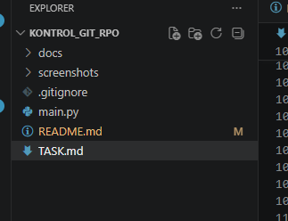
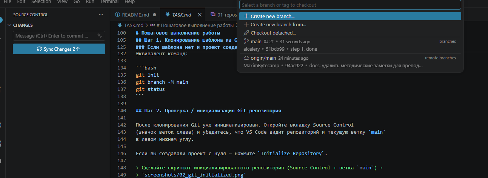
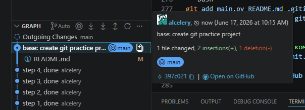
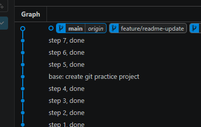
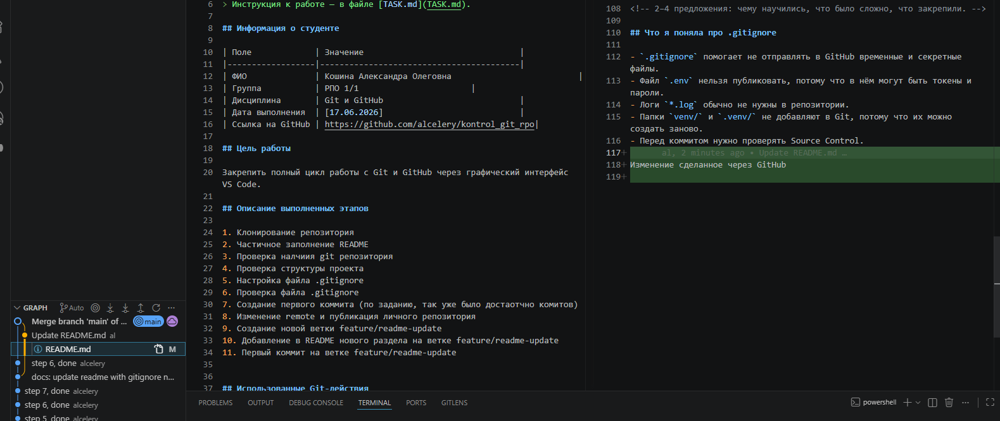
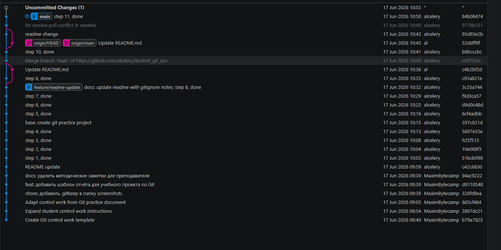

# Контрольная работа: Git, GitHub и VS Code

## Название проекта

Практическая работа с Git и GitHub через графический интерфейс VS Code.

## Цель контрольной работы

Закрепить практические навыки работы с Git, GitHub и репозиторием через VS Code.

В этой работе нужно не просто ответить на вопросы, а выполнить полный практический сценарий:

- склонировать проект;
- открыть его в VS Code;
- проверить или создать структуру проекта;
- настроить `.gitignore`;
- делать коммиты через Source Control;
- опубликовать репозиторий на GitHub;
- создать ветку;
- внести изменения в ветке;
- выполнить merge;
- показать разницу между Fetch и Pull;
- разобрать конфликт;
- оформить `README.md` как отчёт с таблицами и скриншотами.

## Важное правило

Основные Git-действия нужно выполнять через графический интерфейс VS Code:

- Source Control;
- поле `Message`;
- кнопка `Commit`;
- `Publish Branch`;
- `Push`;
- `Sync Changes`;
- `Fetch`;
- `Pull`;
- создание и переключение веток;
- `Merge`;
- Git Graph.

Терминал можно использовать только для запуска программы:

```bash
python main.py
```

или:

```bash
python3 main.py
```

## Что должно получиться в конце

В конце работы у вас должен быть собственный GitHub-репозиторий со следующей структурой:

```text
project-name/
├── README.md
├── .gitignore
├── main.py
└── screenshots/
    ├── 01_repository_created.png
    ├── 02_git_initialized.png
    ├── 03_first_commit.png
    ├── 04_github_repository.png
    ├── 05_branch_created.png
    ├── 06_merge_completed.png
    ├── 07_fetch_or_pull.png
    └── 08_final_git_graph.png
```

Дополнительные файлы можно создавать, если они нужны для вашей программы или отчёта.

## Часть 1. Клонирование шаблона

1. Откройте VS Code.
2. Откройте панель команд:
   - Windows / Linux: `Ctrl + Shift + P`;
   - macOS: `Cmd + Shift + P`.
3. Найдите команду `Git: Clone`.
4. Вставьте ссылку на репозиторий-шаблон, которую дал преподаватель.
5. Выберите папку на компьютере, куда будет склонирован проект.
6. После клонирования нажмите `Open`, чтобы открыть проект в VS Code.

После этого сделайте скриншот открытого проекта и сохраните его как:

```text
screenshots/01_repository_created.png
```

В отчёте напишите:

> Я склонировал репозиторий-шаблон через команду Git: Clone в VS Code и открыл проект локально.

## Часть 2. Проверка структуры проекта

В проекте должны быть файлы:

- `README.md`;
- `.gitignore`;
- `main.py`;
- папка `screenshots/`.

Если какого-то файла нет, создайте его через проводник VS Code.

### Пример содержимого `.gitignore`

Файл `.gitignore` должен содержать:

```gitignore
.env
venv/
__pycache__/
*.log
```

Что это означает:

| Запись | Что игнорируется |
|---|---|
| `.env` | файл с секретными данными, токенами, паролями |
| `venv/` | папка виртуального окружения Python |
| `__pycache__/` | служебная папка Python |
| `*.log` | все файлы с расширением `.log` |

Для проверки можно создать временные файлы:

```text
.env
app.log
```

Они не должны появляться в списке изменений Source Control. После проверки их можно удалить.

## Часть 3. Если проект был выдан пустым

Если преподаватель выдал не готовый шаблон, а пустую папку, выполните дополнительные действия.

1. Откройте пустую папку в VS Code.
2. Перейдите в Source Control.
3. Нажмите `Initialize Repository`.
4. Создайте файлы:
   - `README.md`;
   - `.gitignore`;
   - `main.py`;
   - папку `screenshots/`.

После инициализации сделайте скриншот:

```text
screenshots/02_git_initialized.png
```

В отчёте напишите:

> Я инициализировал локальный Git-репозиторий через кнопку Initialize Repository в Source Control.

Если вы клонировали готовый репозиторий, Git уже инициализирован. В этом случае на скриншоте покажите панель Source Control или Git Graph, где видно, что проект является репозиторием.

## Часть 4. Создание стартовой программы

Откройте файл `main.py`. В нём должна быть простая программа.

Можно использовать такой стартовый вариант:

```python
def show_project_title():
    print("Контрольная работа: Git, GitHub и VS Code")


def show_student_info():
    name = "Иван Иванов"
    group = "ИС-101"
    print(f"Студент: {name}")
    print(f"Группа: {group}")


def show_git_actions():
    actions = [
        "Clone Repository",
        "Initialize Repository",
        "Stage Changes",
        "Commit",
        "Publish Branch",
        "Push / Sync Changes",
        "Fetch",
        "Pull",
        "Create Branch",
        "Merge",
    ]

    print("Git-действия, изученные в работе:")
    for number, action in enumerate(actions, start=1):
        print(f"{number}. {action}")


def main():
    show_project_title()
    print()
    show_student_info()
    print()
    show_git_actions()


if __name__ == "__main__":
    main()
```

Обязательно замените имя, фамилию и группу на свои.

Запустите программу через терминал VS Code:

```bash
python main.py
```

или:

```bash
python3 main.py
```

## Часть 5. Первый коммит

Первый коммит должен зафиксировать стартовую структуру проекта.

1. Откройте Source Control.
2. Посмотрите список изменённых файлов.
3. Добавьте файлы в Stage через кнопку `+`.
4. В поле `Message` напишите осмысленное сообщение.

Пример сообщения:

```text
Create initial project structure
```

5. Нажмите `Commit`.

После первого коммита сделайте скриншот:

```text
screenshots/03_first_commit.png
```

В отчёте напишите:

> Я добавил стартовые файлы проекта в Stage и создал первый коммит через Source Control.

## Часть 6. План коммитов

В работе должно быть несколько осмысленных коммитов. Минимум 5 коммитов.

Рекомендуемый план:

| Номер | Пример сообщения коммита | Что фиксируется |
|---:|---|---|
| 1 | `Create initial project structure` | стартовые файлы проекта |
| 2 | `Configure gitignore` | настройка `.gitignore` |
| 3 | `Add student info to program` | добавление данных студента в `main.py` |
| 4 | `Add feature branch changes` | новая функция в отдельной ветке |
| 5 | `Update README report` | оформление отчёта |
| 6 | `Add screenshots` | добавление скриншотов |

Не используйте сообщения вроде:

```text
fix
test
123
changes
```

Сообщение коммита должно кратко объяснять, что именно изменилось.

## Часть 7. Публикация проекта на GitHub

1. Войдите в GitHub-аккаунт через VS Code, если ещё не вошли.
2. Откройте Source Control.
3. Нажмите `Publish Branch`.
4. Выберите GitHub.
5. Укажите имя репозитория.

Рекомендуемое имя:

```text
git-vscode-control-work
```

или:

```text
git-control-work-surname
```

6. Выберите публичный или приватный репозиторий по указанию преподавателя.
7. Дождитесь публикации.
8. Откройте репозиторий на GitHub в браузере.

Сделайте скриншот страницы GitHub:

```text
screenshots/04_github_repository.png
```

В отчёте укажите ссылку на репозиторий:

```text
Ссылка на репозиторий: https://github.com/username/repository-name
```

## Часть 8. Создание отдельной ветки

Создайте ветку для новой функции.

Вариант через нижнюю панель VS Code:

1. Нажмите на название текущей ветки в нижнем левом углу VS Code.
2. Выберите `Create new branch`.
3. Введите имя ветки.

Рекомендуемое имя ветки:

```text
feature/student-report
```

или:

```text
feature/program-menu
```

Вариант через Git Graph:

1. Откройте Git Graph.
2. Нажмите правой кнопкой мыши на последний коммит ветки `main`.
3. Выберите создание ветки.
4. Переключитесь на новую ветку.

Сделайте скриншот созданной ветки:

```text
screenshots/05_branch_created.png
```

В отчёте напишите:

> Я создал отдельную ветку `feature/student-report`, чтобы выполнить новую функцию отдельно от основной ветки `main`.

## Часть 9. Изменения в ветке

Находясь в новой ветке, измените `main.py`.

Добавьте новую функцию. Например:

```python
def show_completed_steps():
    steps = [
        "Склонирован репозиторий",
        "Настроен .gitignore",
        "Созданы коммиты",
        "Создана отдельная ветка",
        "Выполнено слияние веток",
        "Оформлен README.md",
    ]

    print("Выполненные этапы:")
    for step in steps:
        print(f"- {step}")
```

Затем вызовите её в `main()`:

```python
def main():
    show_project_title()
    print()
    show_student_info()
    print()
    show_git_actions()
    print()
    show_completed_steps()
```

Проверьте запуск программы.

После этого сделайте коммит в ветке.

Пример сообщения:

```text
Add completed steps output
```

## Часть 10. Слияние ветки с `main`

После завершения работы в ветке выполните merge.

1. Переключитесь на ветку `main`.
2. Откройте Git Graph или Command Palette.
3. Выберите команду слияния ветки.
4. Слейте ветку `feature/student-report` в `main`.
5. Проверьте, что изменения из ветки появились в `main.py`.
6. Запустите программу.

Сделайте скриншот результата merge:

```text
screenshots/06_merge_completed.png
```

В отчёте напишите:

> Я переключился на ветку `main` и выполнил merge ветки `feature/student-report`. После слияния изменения из новой ветки появились в основной версии проекта.

## Часть 11. Push и Sync Changes

После локальных коммитов отправьте изменения на GitHub.

Варианты:

- `Push` отправляет локальные коммиты в удалённый репозиторий;
- `Sync Changes` обычно выполняет обмен изменениями: забирает входящие изменения и отправляет исходящие.

В отчёте напишите, что использовали:

> Я использовал Push / Sync Changes, чтобы отправить локальные коммиты в репозиторий на GitHub.

## Часть 12. Fetch и Pull

Нужно показать разницу между Fetch и Pull.

### Вариант практического выполнения

1. Откройте свой репозиторий на GitHub в браузере.
2. Откройте файл `README.md`.
3. Нажмите редактирование файла.
4. Добавьте в конец файла строку:

```text
Проверка удалённых изменений через GitHub.
```

5. Сделайте коммит прямо на GitHub.
6. Вернитесь в VS Code.
7. Выполните `Fetch`.
8. Посмотрите, появились ли входящие изменения.
9. Обратите внимание: после `Fetch` содержимое локального `README.md` ещё не обязано измениться.
10. Выполните `Pull`.
11. Убедитесь, что строка из GitHub появилась в локальном файле.

Сделайте скриншот Fetch или Pull:

```text
screenshots/07_fetch_or_pull.png
```

### Что написать в отчёте

`Fetch` получает информацию о новых коммитах из удалённого репозитория, но не применяет эти изменения к рабочим файлам.

`Pull` получает новые коммиты и применяет их к текущей ветке.

Пример текста:

> Я изменил `README.md` на сайте GitHub и сделал удалённый коммит. Затем в VS Code выполнил Fetch. После Fetch VS Code показал, что в удалённом репозитории есть новые изменения. Затем я выполнил Pull, и эти изменения появились в локальном файле `README.md`.

## Часть 13. Конфликт

Нужно смоделировать конфликт или подробно описать, как он может возникнуть.

### Рекомендуемый способ смоделировать конфликт

1. Убедитесь, что вы находитесь в ветке `main`.
2. Создайте новую ветку:

```text
feature/conflict-example
```

3. В этой ветке откройте `main.py`.
4. Измените строку с названием проекта, например:

```python
print("Контрольная работа по Git в отдельной ветке")
```

5. Сделайте коммит:

```text
Change title in conflict branch
```

6. Переключитесь обратно на `main`.
7. В `main.py` измените эту же строку по-другому:

```python
print("Итоговая контрольная работа по GitHub и VS Code")
```

8. Сделайте коммит:

```text
Change title in main branch
```

9. Попробуйте выполнить merge ветки `feature/conflict-example` в `main`.
10. Если VS Code покажет конфликт, откройте файл с конфликтом.

В конфликтном файле могут появиться специальные отметки:

```text
<<<<<<< HEAD
текущий вариант
=======
входящий вариант
>>>>>>> feature/conflict-example
```

В VS Code обычно доступны кнопки:

- `Accept Current Change`;
- `Accept Incoming Change`;
- `Accept Both Changes`;
- `Compare Changes`.

Выберите нужный вариант или вручную объедините текст.

После решения конфликта:

1. Удалите служебные отметки конфликта, если они остались.
2. Сохраните файл.
3. Добавьте исправленный файл в Stage.
4. Сделайте коммит слияния.

Пример сообщения:

```text
Resolve merge conflict in main.py
```

### Если реальный конфликт не получился

Опишите возможную ситуацию конфликта словами:

> Конфликт может возникнуть, если один и тот же участок файла был изменён в двух разных ветках. Например, в `main` и в `feature/conflict-example` была по-разному изменена строка с названием проекта в `main.py`. При merge Git не может сам выбрать правильный вариант, поэтому VS Code предлагает принять текущий вариант, входящий вариант или объединить оба.

## Часть 14. Git Graph

Откройте Git Graph и проверьте историю.

В истории должны быть видны:

- несколько коммитов;
- ветка для новой функции;
- merge;
- финальные изменения в `README.md`;
- желательно следы работы с конфликтом, если вы его моделировали.

Сделайте итоговый скриншот:

```text
screenshots/08_final_git_graph.png
```

## Часть 15. Оформление `README.md` как отчёта

Этот файл нужно превратить в ваш отчёт. Можно оставлять текст задания, но обязательно заполните разделы ниже.

## Отчёт студента

### Данные студента

Заполните:

| Поле | Значение |
|---|---|
| ФИО | Иванов Иван Иванович |
| Группа | ИС-101 |
| Дата выполнения | 01.01.2026 |
| Ссылка на GitHub | https://github.com/username/repository-name |

### Краткое описание проекта

Напишите 2-4 предложения:

> В этом проекте я выполнил практическую работу по Git, GitHub и VS Code. Я создал Python-программу, настроил `.gitignore`, сделал несколько коммитов, опубликовал проект на GitHub, создал отдельную ветку и выполнил слияние.

### Выполненные этапы

Отметьте выполненные пункты:

- [ ] Проект склонирован из GitHub
- [ ] Проект открыт в VS Code
- [ ] Репозиторий проверен или инициализирован
- [ ] Созданы или проверены файлы `README.md`, `.gitignore`, `main.py`
- [ ] Настроен `.gitignore`
- [ ] Создан первый коммит
- [ ] Репозиторий опубликован на GitHub
- [ ] Создана отдельная ветка
- [ ] В ветке внесены изменения
- [ ] Ветка слита в `main`
- [ ] Выполнен `Fetch`
- [ ] Выполнен `Pull`
- [ ] Описан или решён конфликт
- [ ] Добавлены скриншоты
- [ ] Финальные изменения отправлены на GitHub

### Использованные Git-действия

Отметьте действия, которые вы использовали:

- [ ] Clone Repository
- [ ] Initialize Repository
- [ ] Stage Changes
- [ ] Commit
- [ ] Publish Branch
- [ ] Push
- [ ] Sync Changes
- [ ] Fetch
- [ ] Pull
- [ ] Create Branch
- [ ] Checkout / Switch Branch
- [ ] Merge Branch
- [ ] Resolve Conflict
- [ ] View Git Graph

### Таблица Git-действий

Заполните таблицу своими словами. Можно использовать пример.

| Действие | Где выполнялось в VS Code | Смысл действия |
|---|---|---|
| Clone Repository | Command Palette | Копирует удалённый репозиторий с GitHub на компьютер |
| Initialize Repository | Source Control | Создаёт локальный Git-репозиторий в папке проекта |
| Stage Changes | Source Control | Подготавливает выбранные изменения к коммиту |
| Commit | Source Control | Сохраняет версию проекта в истории Git |
| Publish Branch | Source Control | Публикует локальную ветку или проект на GitHub |
| Push | Source Control | Отправляет локальные коммиты на GitHub |
| Sync Changes | Source Control | Синхронизирует локальные и удалённые изменения |
| Fetch | Source Control | Проверяет новые изменения на GitHub без применения к файлам |
| Pull | Source Control | Загружает и применяет изменения из GitHub |
| Create Branch | Нижняя панель VS Code | Создаёт отдельную ветку для задачи |
| Switch Branch | Нижняя панель VS Code | Переключает проект на другую ветку |
| Merge | Git Graph или Command Palette | Объединяет изменения из одной ветки с другой |
| Resolve Conflict | Редактор VS Code | Помогает выбрать или объединить конфликтующие изменения |
| Git Graph | Расширение Git Graph | Показывает историю коммитов и веток |

### Мои коммиты

Заполните таблицу по своей истории Git.

| Номер | Сообщение коммита | Что было изменено |
|---:|---|---|
| 1 | `Create initial project structure` | Созданы стартовые файлы проекта |
| 2 | `Configure gitignore` | Настроен `.gitignore` |
| 3 | `Add student info to program` | В программу добавлена информация о студенте |
| 4 | `Add completed steps output` | В ветке добавлена новая функция |
| 5 | `Update README report` | Оформлен отчёт |

### Работа с веткой

Заполните:

```text
Название ветки: feature/student-report
Что было сделано в ветке: добавлена функция вывода выполненных этапов
Как ветка была слита: через Merge в VS Code
```

### Разница между Fetch и Pull

Объясните своими словами.

Пример:

> Fetch проверяет и загружает информацию о новых коммитах из GitHub, но не меняет мои рабочие файлы. Pull загружает изменения и сразу применяет их к текущей ветке. Я проверил это, когда изменил `README.md` на GitHub, затем сделал Fetch в VS Code, а после этого Pull.

### Конфликт и решение

Опишите ваш конфликт или учебный пример.

Пример:

> Я смоделировал конфликт в файле `main.py`: в ветке `main` и в ветке `feature/conflict-example` была изменена одна и та же строка. При merge VS Code показал конфликт. Я сравнил варианты, выбрал подходящий текст, сохранил файл, добавил его в Stage и сделал коммит с решением конфликта.

## Скриншоты

Добавьте скриншоты в папку `screenshots/` и вставьте их в отчёт.

Обязательные файлы:

| Файл | Что должно быть на скриншоте |
|---|---|
| `01_repository_created.png` | Склонированный или созданный проект в VS Code |
| `02_git_initialized.png` | Инициализированный Git-репозиторий или панель Source Control |
| `03_first_commit.png` | Первый коммит в Source Control или Git Graph |
| `04_github_repository.png` | Опубликованный репозиторий на GitHub |
| `05_branch_created.png` | Созданная отдельная ветка |
| `06_merge_completed.png` | Результат merge |
| `07_fetch_or_pull.png` | Выполнение Fetch или Pull |
| `08_final_git_graph.png` | Итоговая история в Git Graph |

### 1. Созданный проект



### 2. Инициализированный репозиторий



### 3. Первый коммит



### 4. Репозиторий на GitHub


### 5. Созданная ветка


### 6. Выполненный merge



### 7. Fetch или Pull



### 8. Итоговая история Git Graph



## Чек-лист перед сдачей

Проверьте себя:

- [ ] Репозиторий опубликован на GitHub
- [ ] В репозитории есть `README.md`
- [ ] В репозитории есть `.gitignore`
- [ ] В репозитории есть `main.py`
- [ ] В репозитории есть папка `screenshots/`
- [ ] В `.gitignore` указаны `.env`, `venv/`, `__pycache__/`, `*.log`
- [ ] Есть минимум 5 осмысленных коммитов
- [ ] Есть отдельная ветка для новой функции
- [ ] Выполнен merge ветки в `main`
- [ ] Выполнен Push или Sync Changes
- [ ] Описана разница Fetch и Pull
- [ ] Описан конфликт и способ его решения
- [ ] Все 8 скриншотов добавлены в `screenshots/`
- [ ] Скриншоты отображаются в `README.md`
- [ ] Ссылка на GitHub указана в отчёте

## Критерии оценивания

| Критерий | Баллы |
|---|---:|
| Проект склонирован или создан, открыт в VS Code | 5 |
| Репозиторий корректно инициализирован или проверен после клонирования | 5 |
| Файлы `README.md`, `.gitignore`, `main.py` созданы и оформлены | 10 |
| `.gitignore` настроен правильно | 10 |
| Есть минимум 5 осмысленных коммитов | 15 |
| Репозиторий опубликован на GitHub | 10 |
| Создана отдельная ветка и выполнена работа в ней | 10 |
| Ветка слита в `main` через Merge | 10 |
| Показана и объяснена разница между Fetch и Pull | 10 |
| Смоделирован или подробно описан конфликт | 10 |
| README оформлен как полноценный отчёт | 10 |
| Добавлены все обязательные скриншоты | 10 |
| **Итого** | **115** |

## Что сдавать

Сдайте преподавателю:

1. Ссылку на GitHub-репозиторий.
2. Готовый `README.md` с отчётом.
3. Папку `screenshots/` с обязательными скриншотами.
4. Финальную версию `main.py`.

## Частые ошибки

- Репозиторий создан, но не опубликован на GitHub.
- Все изменения сделаны одним коммитом.
- Коммиты называются неосмысленно: `123`, `fix`, `test`.
- Скриншоты лежат не в папке `screenshots/`.
- Названия скриншотов не совпадают с заданием.
- В `.gitignore` забыли добавить `*.log`.
- Ветка создана, но изменения сделаны в `main`.
- Merge не выполнен.
- Fetch и Pull описаны одинаково.
- В README нет ссылки на GitHub-репозиторий.

